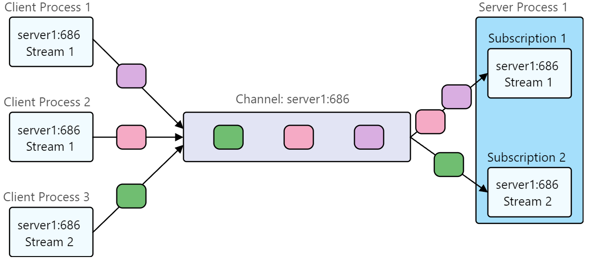

# 一、Overview of Aeron

Aeron的目标是提供低延迟，可靠的单播，组播以及IPC通信。支持Java，C++和.NET。设
# 二、Media Driver
## overview
Media Driver主要职责负责管理publication和subscription通过媒介(UDP或IPC)发送接收数据。其设计是运行在多核多进程模式下。
其实现可靠组播的三个设计原则为：

1.结构化的消息日志

2.消息头填入消息信息

3.接收方使用Complete和High Watermark

## component
### Driver Conductor

Driver Conductor接收来自Aeron客户端内publication和subscription的命令，并设定Media Driver的运行。

除此之外Driver Conductor负责命名的解析工作。

### Receiver

Recevier管理连接media所接受的所有数据。数据传输轮询器接收UDP数据，并使用Java NIO与操作系统的网络战进行交互。

### Sender

Sender管理通过media的传输

### Client Conductor

Client Conductor主要负责与Driver Conductor通信

## Media Driver Folder

存放与Media Driver相关的文件

## Configuration & Runtime Deployment options

Media Driver可以运行在进程里或者进程外，当运行在进程外，可以使用Java或者C的Media Driver。

### Configuration approaches

有两个可选的配置方法配置Media Driver

通过系统配置，使用-D参数

通过MediaDriver Context object，配置直接应用到Media Driver Configuration object

``errorHandler`` 错误处理

``aeronDirectoryName`` 指定Media Driver运行的目录，多个Aeron Clients（跨进程）可以共享

``idleStragies`` 空闲策略

``deleteDirOnStart`` aeronDirectoryName在创建的时候会被初始化，一个aeronDirectoryName对应一个Media Driver

``deleteDirOnShutdown`` Media Driver退出的时候清理

## Media Driver Threading Mode

在Media Conductor中需要运行Sender和Receiver以及Media Driver，需要指定这三者的运行方式。

### Dedicated

Sender,Receiver和Media Driver分别运行一个线程，每一个线程有特定空闲策略。这是默认的方式，性能最好，但是主要运行在资源充足的情况下。

### Shared Network

Sender和Receiver运行在一个完整的agent中

### Shared

Sender，Receiver和Media Driver运行在同一个线程中，这个模式适用于资源不充足的情况下。

### Invoker

这个模式下没有线程被运行。

# 三、Channels,Streams and Sessions
通过定义Channel和Stream ID来使得Publication和Subscription进行配对，channel在配置上书写上类似于TCP/IP，需要IP Address和Port。
但是在使用上并非与TCP/IP相同，同一个channel可以通过Stream ID传输不同的数据。

在给定的Channel和Stream ID只发送单一数据的情况下，数据源是确定的。但是如果该Channel和Stream ID上有多个发送者时，就需要使用Session ID
来确认数据源。

根据之前使用NAK的可靠UDP重传根据Channels，Streams和SessionID来对于不同的数据源进行重排序。

